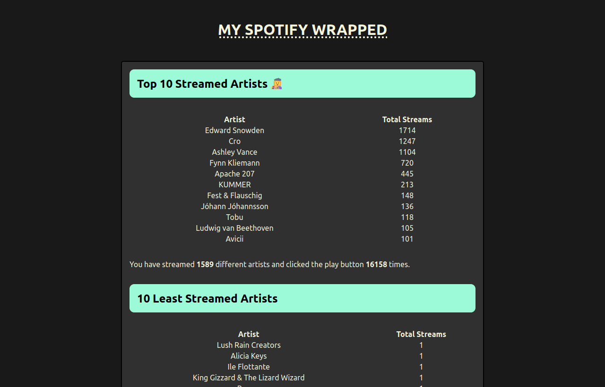

# My Spotify Wrapped

I created this script since a good friend of mine was not satisfied with the content of this years (2022) Spotify Wrapped content.
So this script converts the data Spotify gathers from you into a nice visual representation in the form of a html document.
It relies on the personal data disclosure you can request from Spotify via this [page](https://www.spotify.com/de/account/privacy/). You can request this at any time thanks to the European GDPR (General Data Protection Regulation).



## Usage

1. Clone this repository
2. Install dependencies
3. Request your personal data including streaming history from Spotify
4. Unpack archive you got form Spotify
5. Execute the script
```
python main.py -d PATH_TO_STREAMING_HISTORY_JSON -s PATH_TO_OUT_FOLDER
```


## Upcoming
- [ ]  Executable for every major operating system
- [ ]  Maybe webapp